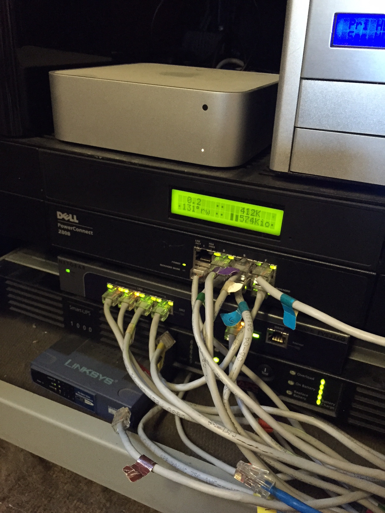

# iPulse

iPulse 3 is [now available](https://ipulseapp.com). The code below won't work with [System Integrity Protection](https://en.wikipedia.org/wiki/System_Integrity_Protection), so instead of building this old version of the app, I suggest that you [buy an updated version](https://itunes.apple.com/us/app/ipulse/id1028916583?ls=1&mt=12&uo=4&pt=8934&at=10l4G7&ct=IPULSE_GITHUB).

[iPulse](http://iconfactory.com/software/ipulse) was my first Cocoa app. This project was started [in 2002](http://iconfactory.com/software/ipulse_history) and the app runs fine on OS X releases since 10.5.

The code, however, is an abomination: the main controller for the app is over 8,200 lines and there is so much refactoring needed it's not even funny. Unfortunately, the architecture of this app was done before I understood how to build things with AppKit and Foundation. Also, much of the code was written before things like Cocoa Bindings and properties even existed (look at the Preferences class to see how far we've come in the past ten years!)

**Do not** look at iPulse an example of best practices in Cocoa app design. Look at it as a classic case of how a n00b can screw things up so badly that their more experienced self doesn't have the will to go clean things up years later.

That said, the app still works great and I run it all the time. And despite its usefulness, iPulse is not a source of revenue anymore, so I've decided to make it available free of charge. Open source with warts and all.

Build and run and **try not to** look at the source code. There is [extensive user help](English.lproj/Help.html) that explains the information being presented by iPulse. Localized help is available from the app's Help menu.

I'll do my best to keep the iPulse running on the latest version of OS X since it's an important tool for the work I do. If you find bugs, come up with new features or are **brave enough** to refactor the code, I'll be happy to take pull requests.

## Code Structure

You're kidding, right? It's all in `MainController.m`!

If you do dare to look at the source, there are some common places to look in the app:

### Info classes

These classes are used to maintain circular buffers of sampled data. `MemoryInfo.m` has memory usage, `AirportInfo.m` has Wi-Fi data, etc.

Other types of data that aren't tracked historically are queried directly by the gauge on an as-needed basis.

### Gauges

Each statistic is shown using a "gauge". The gauge is drawn using methods in MainController like these for the CPU:

`- (void)drawProcessorGauge` draws the graphical part of the gauge in the window or icon.

`- (void)drawProcessorText` draws the textual parf of the gauge.

`- (BOOL)inProcessorGauge:(GraphPoint)atPoint` determines if the mouse cursor is hovering over the gauge (to display additional information.)

`- (void)drawProcessorInfo:(GraphPoint)atPoint withIndex:(int)index` takes a template RTF file and fills it with additional information and displays it.

`- (void)drawProcessorStatusAt:(StatusType)statusType` draws a gauge in the menubar (as a status item.)

### Optional code

I never released a public version of iPulse with `OPTION_INCLUDE_MATRIX_ORBITAL` defined, but there is a bunch of code that lets iPulse display information on an external 20 × 2 character LCD display. The code was written for the discontinued [PK202-24-USB](http://www.matrixorbital.ca/manuals/Legacy/PK_series/PK202-24-USB/), but in theory [newer versions](http://www.matrixorbital.com/p974/BLC2021-BL-USB/product_info.html) that use the same commands should work.

My LCD display is attached to a headless Mac mini that I use as a server in the garage. This makes it easy to keep an eye on things without opening a virtual desktop. Here's what it looks like:

## Building

The `iPulse` target should be used to make your own copy of the app.

The `iPulse (Signed)` and `Distribution_Iconfactory` targets are used to build a version signed with a Developer ID that can be updated with Sparkle. These are used via the `build_release` script. I'll use them to do periodic binary releases.

## Buying iPulse

You can [buy a copy of the app for $10](https://ipulseapp.com). This new version has support for Retina displays, contains many new features including compatibility with System Integrity Protection, and works on the latest versions of macOS. Distribution on the Mac App Store also makes it easy to install on any Mac you own. Think of it as a way to help buy the whiskey needed after I refactored this source code :-)

